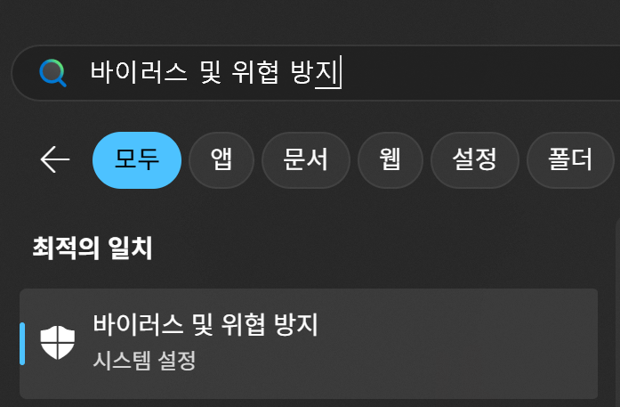
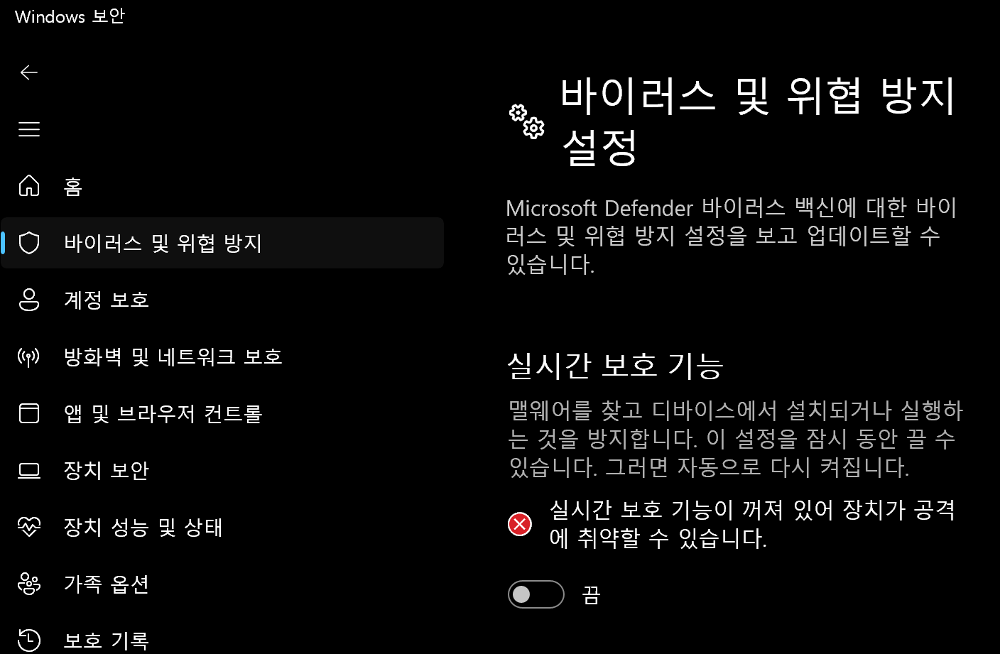
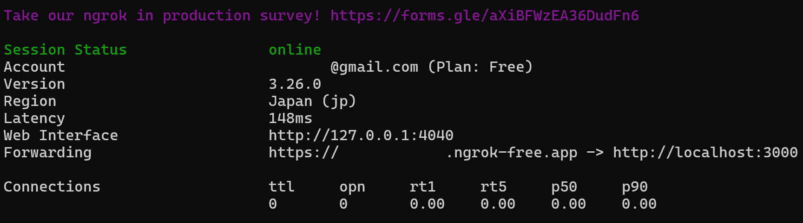

## Home File Server 만들기

### 사전 작업

- file server 환경 구축

  ```shell
  mkdir file-server
  cd file-server
  npm init -y
  npm i express
  ```

- Postman 설치  
  https://www.postman.com/

### 1단계: 간단한 API 만들기

목표: Node.js와 Express.js를 사용하여 기본적인 API 서버를 설정합니다.

- express를 이용하여 3000번 포트를 통해 서버를 열어주세요.
  - 서버가 실행될 때는 `서버가 http://localhost:${port} 에서 실행 중입니다.`가 출력되어야합니다.
- "/" get 함수 하나를 만듭니다.
  http://localhost:3000/ 으로 호출했을 때, `파일 업로드 서버`라는 값을 리턴하도록 합니다.

<details>
<summary>답안</summary>

```js
const express = require("express");
const app = express();
const port = 3000;

app.get("/", (req, res) => {
  res.send("파일 업로드 서버");
});

app.listen(port, () => {
  console.log(`서버가 http://localhost:${port} 에서 실행 중입니다.`);
});
```

</details>

### 2단계: 파일 업로드 시스템 만들기

목표: multer 라이브러리를 사용하여 파일 업로드 기능을 함께 작성해봅니다.

[사전 설치]

```shell
npm i multer
```

[코드]

- file upload시, fieldname을 이용한 예시

```js
const express = require("express");
const multer = require("multer");
const path = require("path");

const app = express();
const port = 3000;

// 파일 저장 경로 및 이름 설정
const storage = multer.diskStorage({
  destination: "./uploads/",
  filename: function (req, file, cb) {
    cb(
      null,
      file.fieldname + "-" + Date.now() + path.extname(file.originalname)
    );
  },
});

const upload = multer({ storage: storage });

// 파일 업로드 라우트
// upload.any(): multer 미들웨어를 사용하여 어떤 이름이든 허용
app.post("/upload", upload.any(), (req, res) => {
  res.send("파일 업로드 성공");
});

app.listen(port, () => {
  console.log(`서버가 http://localhost:${port} 에서 실행 중입니다.`);
});
```

- file upload시, originalname을 이용한 예시

```js
const express = require("express");
const multer = require("multer");
const path = require("path");

const app = express();
const port = 3000;

// 파일 저장 경로 및 이름 설정
const storage = multer.diskStorage({
  destination: "./uploads/",
  filename: function (req, file, cb) {
    cb(
      null,
      file.originalname + "-" + Date.now() + path.extname(file.originalname)
    );
  },
});

const upload = multer({ storage: storage });

// 파일 업로드 라우트
// upload.any(): multer 미들웨어를 사용하여 어떤 이름이든 허용
app.post("/upload", upload.any(), (req, res) => {
  res.send("파일 업로드 성공");
});

app.listen(port, () => {
  console.log(`서버가 http://localhost:${port} 에서 실행 중입니다.`);
});
```

### Postman 사용법

**요청 방식**: POST

**URL**: http://localhost:3000/upload

**Body**: form-data

**Key**: file (서버 코드에서 upload.single('file')로 설정했으므로 file이라는 키를 사용해야 합니다.)

**Value**: File 선택 후 업로드할 파일 선택

**Headers**: Content-Type은 form-data를 선택하면 자동으로 설정되므로 직접 설정할 필요가 없습니다.

---

### 퀴즈

위 처럼하면 아래와 같이 originmalname에 확장자가 함께 나옴을 알 수 있다.

`ex: 11.PNG-1750983112306.PNG`

어떻게해야 `11-{timestamp}.{ext}`형태로 나타나게 할 수 있을까?

<details>
<summary>답안</summary>

```js
const express = require("express");
const multer = require("multer");
const path = require("path");

const app = express();
const port = 3000;

// 파일 저장 경로 및 이름 설정
const storage = multer.diskStorage({
  destination: "./uploads/",
  filename: function (req, file, cb) {
    // 파일명에서 확장자 제외
    // const filenameWithoutExt = file.originalname.split(".").slice(0, -1).join(".");
    // cb(null, filenameWithoutExt + "-" + Date.now() + path.extname(file.originalname));

    const fileName = file.originalname.split(".").slice(0, -1).join(".");
    const fileExt = file.originalname.split(".").slice(-1);
    cb(null, `${fileName}-${Date.now()}.${fileExt}`);
  },
});

const upload = multer({ storage: storage });

// 파일 업로드 라우트
// upload.any(): multer 미들웨어를 사용하여 어떤 이름이든 허용
app.post("/upload", upload.any(), (req, res) => {
  res.send("파일 업로드 성공");
});

app.listen(port, () => {
  console.log(`서버가 http://localhost:${port} 에서 실행 중입니다.`);
});
```

</details>

### 3단계: 파일 다운로드 기능 만들기

목표 : download api path를 추가하여 업로드 한 파일을 다운받을 수 있도록 해봅니다.

```js
const express = require("express");
const multer = require("multer");
const path = require("path");
const fs = require("fs");

const app = express();
const port = 3000;

// 파일 저장 경로 및 이름 설정
const storage = multer.diskStorage({
  destination: "./uploads/",
  filename: function (req, file, cb) {
    const fileName = file.originalname.split(".").slice(0, -1).join(".");
    const fileExt = file.originalname.split(".").slice(-1);
    cb(null, `${fileName}-${Date.now()}.${fileExt}`);
  },
});

const upload = multer({ storage: storage });

// 파일 업로드 라우트
app.post("/upload", upload.any(), (req, res) => {
  res.send("파일 업로드 성공");
});

// 파일 다운로드 라우트
app.get("/download/:filename", (req, res) => {
  const fileName = req.params.filename; // 요청 URL에서 파일명 받기
  const filePath = path.join(__dirname, "uploads", fileName);

  // 파일 존재 여부 확인
  if (fs.existsSync(filePath)) {
    res.download(filePath, fileName, (err) => {
      if (err) {
        console.error("파일 다운로드 중 오류:", err);
        res.status(500).send("파일 다운로드 실패");
      }
    });
  } else {
    res.status(404).send("파일을 찾을 수 없습니다");
  }
});

app.listen(port, () => {
  console.log(`서버가 http://localhost:${port} 에서 실행 중입니다.`);
});
```

### 4단계: ngrok 이용하기

목표: ngrok을 이용하여 외부에서도 localhost:3000에 접근할 수 있도록 설정해봅니다.

- download

  - mac
    `brew install ngrok`

  - window
    https://ngrok.com/downloads/windows?tab=download

    `바이러스가 발견됨` 때문에 다운로드가 안되는 경우  
    (ngrok는 바이러스가 아님!
    https://ngrok.com/docs/faq/#is-ngrok-a-virus)

    

    

- ngrok authtoken 발급

  - https://dashboard.ngrok.com/authtokens 접속

  - Add Tunnel Authtoken을 눌러 토큰 발급 후 복사

  - 해당 토큰을 ngrok 터미널에 입력

    `ngrok config add-authtoken {방금 받은 토큰}`

  - 3000번 포트를 외부에서 접근 가능하도록 설정  
    `ngrok http 3000`

  - 아래 화면이 나오면 성공!  
    

  - 이제 http://localhost:3000 대신, 위에서 발급받은 uri로 교체하여 실습해보고, 정말 외부에서도 접근이 가능한지 스마트폰을 이용해서도 한번 홈 서버를 경험해보자.
