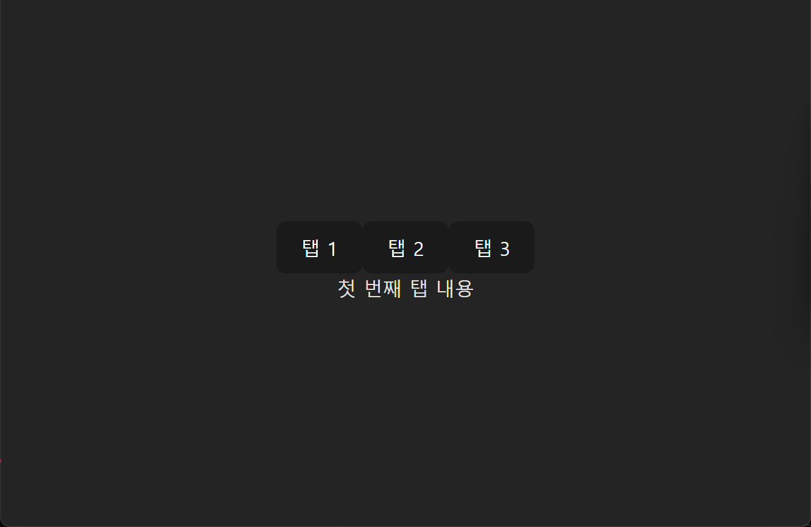
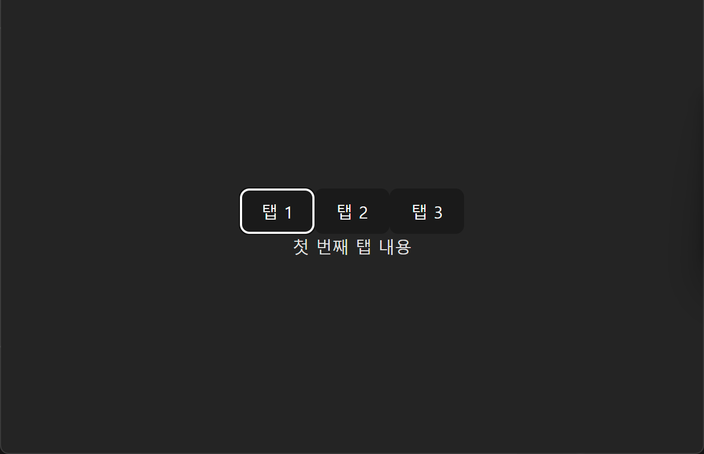
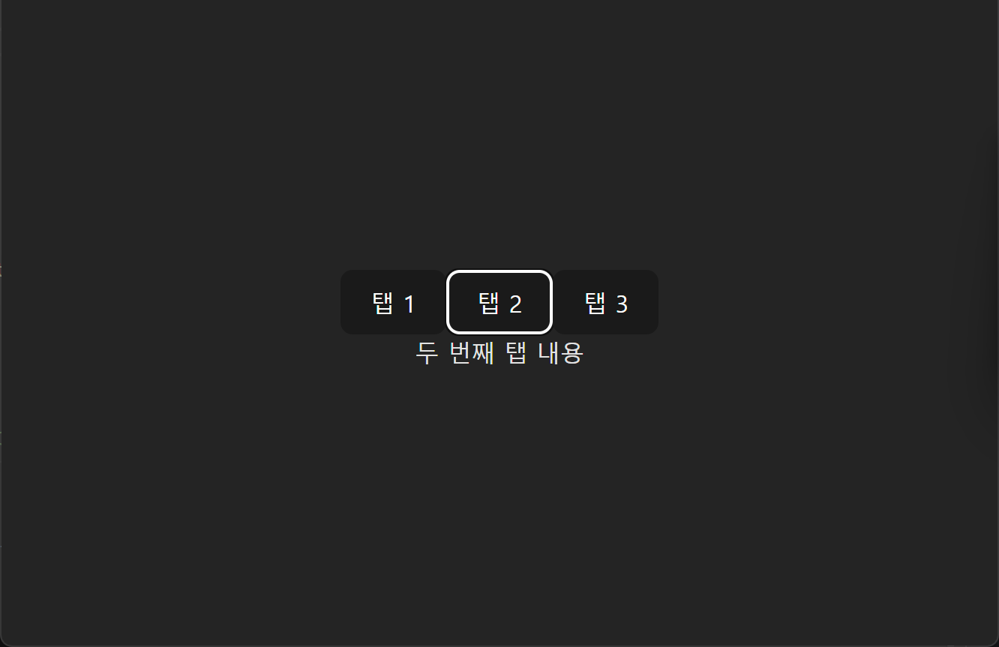
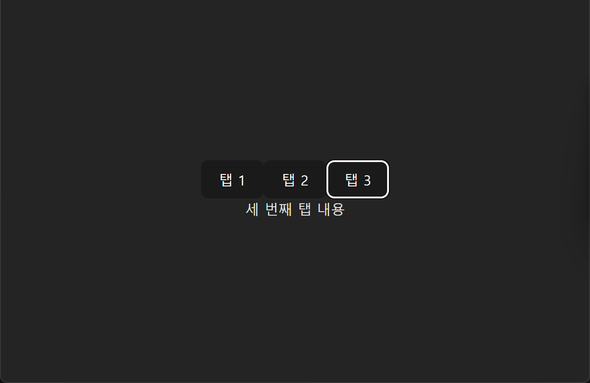

## tab component 예제

다음과 같은 형태로 나오는 탭 컴포넌트를 구현해보고자합니다.

아무것도 선택하지 않았을 때

1번을 선택했을 때

2번을 선택했을 때

3번을 선택했을 때


이때 아래처럼 구현의 일부분만 주어질 때, 구현을 마무리해보고자합니다. (type 이용)

구성은 다음과 같이 합니다.

App.tsx

```tsx
import "./App.css";
import Tab from "./components/Tab";

function App() {
  return (
    <>
      <Tab />
    </>
  );
}

export default App;
```

src/components/Tab.tsx

```tsx
import { useState } from "react";

const tabs; // tab data 정의

function Tab() {
  const [activeTab, setActiveTab] = useState<number>(1);

  return (
    <div>
      <div>
        {tabs.map((tab) => (
          <button key={tab.id} /** 클릭 시 이벤트 추가 */>{tab.label}</button>
        ))}
      </div>
      <div>{/** 현재 탭에 대한 content를 보여주기 */}</div>
    </div>
  );
}

export default Tab;
```
